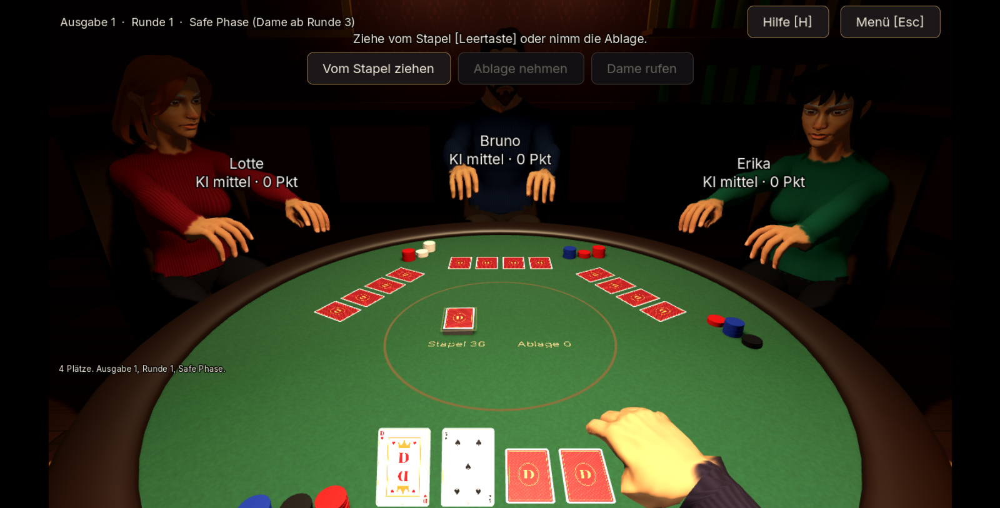
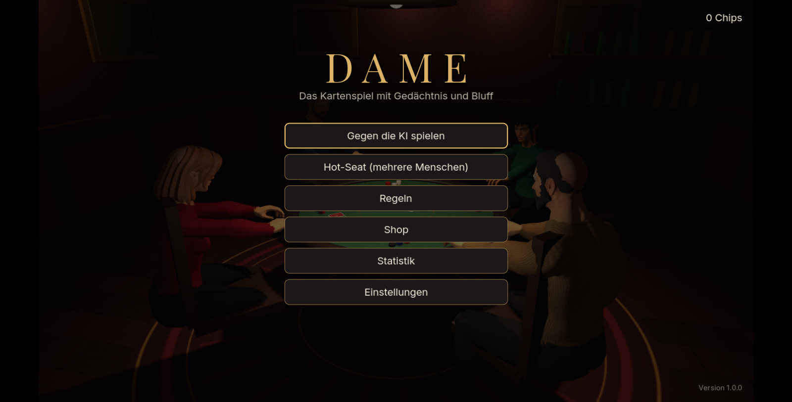
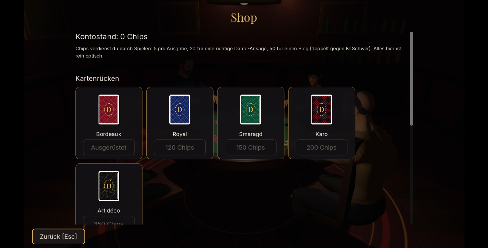
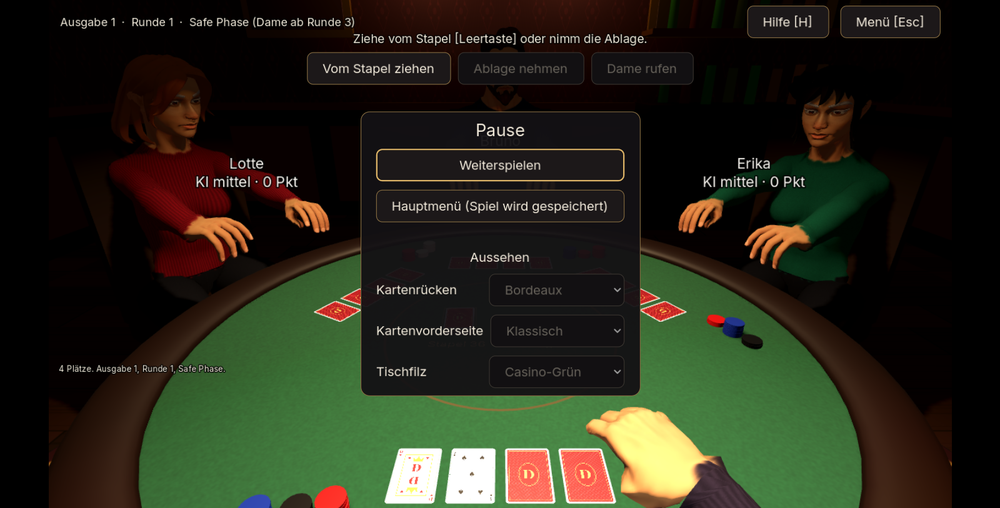

<div align="center">

# ♛ DAME

**Gedächtnis. Risiko. Bluff.**

Ein taktisches Kartenspiel für 2–6 Spieler in der **Egoperspektive an einem 3D-Casinotisch**.  
Du sitzt in einem dunklen Hinterzimmer unter der Hängelampe, deine Gegner sitzen mit dir am Tisch —  
und deine eigene Hand zieht, hält und legt die Karten.

<br>

[](https://godotengine.org/)
[](https://deusexlumen.github.io/Dame-Card-Game/)
[](#entwicklung)
[](#was-ist-dame)
[](#)
[](./LICENSE)

<br>

### [▶ Jetzt live spielen](https://deusexlumen.github.io/Dame-Card-Game/)

*Kein Installieren nötig — läuft direkt im Browser. Als App installierbar (PWA),  
steuerbar per Maus, Tastatur oder Touch.*

**[English version](./README_EN.md)**

</div>

---

## Screenshots

<p align="center">
  
  <br>
  <em>Der Tisch in Egoperspektive — Lotte, Bruno und Erika warten auf deinen Zug.</em>
</p>

<p align="center">
  
  &nbsp;&nbsp;
  
  <br>
  <em>Links: Hauptmenü im Casino-Hinterzimmer · Rechts: Shop für Kosmetik, bezahlt mit erspielten Chips</em>
</p>

<p align="center">
  
  <br>
  <em>Kosmetik-Schnellauswahl direkt im Pausenmenü.</em>
</p>

---

## Was ist DAME?

Ein taktisches Gedächtnis-Kartenspiel mit Bluff: **Deine eigenen Karten liegen verdeckt vor dir — du kennst sie nur aus dem Gedächtnis.**

- Jeder bekommt **4 verdeckte Karten** und darf sich **2** davon ansehen.
- Ziehe, tausche, lege ab — und merke dir genau, was wo liegt.
- Ab Runde 3 darfst du **„Dame“ rufen**, wenn du glaubst, die wenigsten Punkte zu haben.
- Fehler kosten **genau eine Strafkarte**. Über 50 Punkte scheidest du aus — genau 50 setzt dich auf 0 zurück.

Die verbindlichen Regeln stehen in [`CONCEPT_DECISIONS.md`](./CONCEPT_DECISIONS.md), die volle Anleitung auch im Spiel (Menü „Regeln“ oder Taste **H** am Tisch).

## Features

**🎰 Der Tisch**
- **3D-Casinotisch in Egoperspektive** mit echten Figuren — Sitz-Animationen, Hände auf dem Tisch, greifen nach Stapel und Ablage. Deine eigene Hand hat bewegliche Finger.
- Casino-Hinterzimmer mit Bar, Chip-Stapeln und Gold-Theme. Umschaltbar auf eine klassische **2D-Ansicht**.
- **Besondere Momente**: Dame-Ruf mit rotem Puls, Karten drehen sich nacheinander um, Punkte zählen hoch, Konfetti beim Sieg.

**🃏 Das Spiel**
- **2–6 Spieler** — Mensch gegen KI (3 Stufen) oder Hot-Seat an einem Gerät. Ab 5 Spielern werden zwei Decks gemischt.
- Zugtimer: Wer zu lange braucht, zieht eine Strafkarte.
- Statistik über Partien, Dame-Ansagen, Siegquote — und **Speichern & Fortsetzen**.

**💰 Fortschritt ohne Pay-to-Win**
- **Shop nur für Kosmetik**: Kartenrücken, Kartenvorderseiten, Tischfilz — bezahlt mit Chips, die du durchs Spielen verdienst.
- Schnellauswahl im Pausenmenü, ohne den Tisch zu verlassen.

**🔊 Sound & Sprachen**
- Echte Kartengeräusche und ein ruhiger Jazz-Loop.
- Vollständig auf **Deutsch und Englisch**.

## Steuerung

| Taste | Aktion |
|---|---|
| `1`–`6` | Karte wählen |
| `Leertaste` | Vom Stapel ziehen |
| `Enter` | Bestätigen / Zug beenden |
| `A` | Gezogene Karte ablegen |
| `X` | Extra ablegen |
| `D` | Dame rufen |
| `H` | Anleitung |
| `Esc` | Abbrechen / Menü |

Oder einfach: **Maus oder Touch**.

## Online-Multiplayer — in Arbeit

DAME soll in Gesellschaft online spielbar werden — **ohne eigenen Server, bei Kosten von ca. 0 €**:

- **WebRTC Peer-to-Peer**, host-autoritativ: Ein Spieler führt das Regelwerk aus, Gäste senden nur Aktionen und erhalten ihre Sicht.
- **Raumcodes** (z. B. `KX7Q`) über kostenloses Supabase-Realtime-Signaling — danach läuft alles direkt von Peer zu Peer. Copy-Paste-Code als Notfall-Fallback.
- **Plattformübergreifend**: Web, Windows und Android — das Spiel ist überall gleich.
- Ehrliche Grenzen: Kein TURN-Server in v1 (ein Teil der NATs scheitert), Host weg = Partie ohne Wertung vorbei, kein öffentliches Matchmaking.

Den vollständigen Plan mit Architektur, Kosten und Risiken gibt es in [`docs/online-p2p-plan.md`](./docs/online-p2p-plan.md).

## Entwicklung

Das Spiel ist ein **Godot-4.7-Projekt** in [`godot/`](./godot) (GL Compatibility). Die alte React-Fassung unter `src/` bleibt nur als Nachschlagewerk.

```bash
npm run test:godot       # Headless-Tests und Szenenfluss
npm run export:godot     # Windows (build/windows/Dame.exe) und Web (build/web)
npm run test:godot:web   # Web-Build im Browser prüfen (Playwright)
```

Godot-Pfad lokal per `GODOT_BIN` änderbar. Jeder Push auf `main` testet, exportiert und veröffentlicht den Web-Build auf GitHub Pages.

Werkzeuge für Assets liegen in `godot/tools/assets/` (Kartengrafiken, Raumtexturen, Kleidungsmasken).

## Credits

- Figuren und Animationen: [Quaternius](https://quaternius.com) (CC0)
- Kartengeräusche, Klicks, Jingles: [Kenney](https://kenney.nl) (CC0)
- Musik: „jazz improvisation looped“ von Alex McCulloch / Pro Sensory (CC0)
- Schriften: Inter und Playfair Display (SIL OFL), DejaVu (frei)
- WebRTC unter Windows/Linux: [webrtc-native](https://github.com/godotengine/webrtc-native) (MIT, per `npm run fetch:webrtc` geladen, nicht eingecheckt)

Details: `godot/assets/audio/CREDITS.txt`, `godot/assets/characters/LICENSE_*.txt`, `godot/assets/fonts/`, `godot/addons/webrtc/README.md`.
