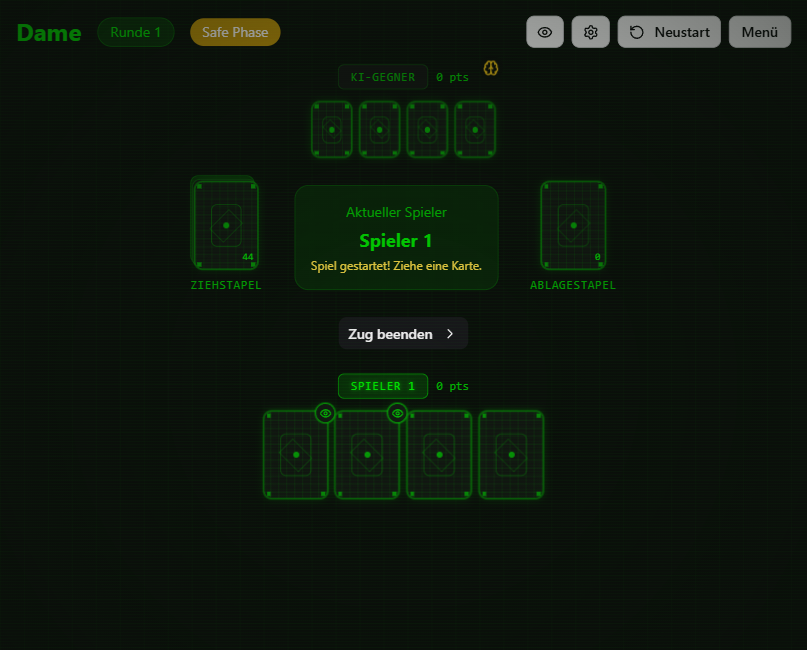

# ♛ DAME — Memory, Risk & Bluff

[](./)
[](https://deusexlumen.github.io/Dame-Card-Game/)
[](https://github.com/deusexlumen/Dame-Card-Game/actions)
[](./)
[](https://react.dev/)
[](https://www.typescriptlang.org/)
[](https://vitejs.dev/)
[](https://tailwindcss.com/)

> **A browser-based card game for 2–6 players.**  
> Human vs. human or human vs. AI — fully client-side, no backend, no tracking.

> 🚧 **Alpha version:** The game is playable, but features, balance and UI may still change. Feedback welcome!

🚀 **Play live:** https://deusexlumen.github.io/Dame-Card-Game/

🌐 **German version:** [README.md](./README.md)

---

## 🎴 What is DAME?

DAME is a tactical memory card game with bluffing elements. You never really know your own cards — only what you can remember.

- Each player gets **4 face-down cards** and may look at **only 2** of them.
- After that the cards stay face down. You have to remember **position and value**.
- Draw, swap, bluff — and call **"Dame"** at the right moment to end the round.
- Mistakes are punished with **penalty cards**. Information is everything.

Visually DAME feels like the **terminal of an archived cyber system**: black background, green phosphor glow, geometric symbols, monospace typography.

---

## ✨ Features

|  |  |
|---|---|
| 🎮 **2–6 players** | Human vs. human or with AI opponents |
| 🤖 **3 AI levels** | Easy, Medium, Hard — with different aggression and bluffing strategies |
| 👁️ **Jack (J)** | Look at your own or an opponent's card |
| 👑 **King (K)** | Briefly reveal an opponent's card and swap it deliberately |
| 🃏 **Queen (Q)** | Penalty card when discarded; open Queen forces the next player to take it |
| ⚡ **Extra discard** | Discard matching cards immediately |
| 📢 **Dame call** | End the round early — but beware of a wrong call |
| 🎯 **50-point rule** | Over 50 = eliminated, exactly 50 = reset to 0 |
| 📊 **Statistics** | Local game statistics in the browser |
| 🔊 **Sound & music** | Procedural Web Audio sounds, toggleable ambient music |
| 🎬 **Animations** | Framer Motion transitions for cards and UI |
| ♿ **Accessibility** | Keyboard controls, ARIA labels, screen reader support |

---

## 🕹️ Quick start

```bash
# 1. Clone repo
git clone https://github.com/deusexlumen/Dame-Card-Game.git
cd Dame-Card-Game

# 2. Install dependencies (pnpm)
pnpm install

# 3. Start dev server
pnpm dev

# 4. Run tests
pnpm test
```

Done! The server usually runs at `http://localhost:5173/Dame-Card-Game/`.

---

## 📋 Core rules

1. **Setup:** 4 face-down cards per player, 2 of which may be peeked at.
2. **Turn:** Draw from the draw or discard pile. Decide: keep, swap, or discard.
3. **Extra discard:** If you have a card with the same value as the top discard card, you may discard it immediately.
4. **Special cards:**
   - **Queen (Q)** → Penalty card when discarded; an open Queen must be taken by the next player.
   - **Jack (J)** → Look at any face-down card.
   - **King (K)** → Reveal an opponent's card and swap it deliberately.
5. **Dame call:** Whoever believes they have the lowest points calls "Dame". If wrong, they start the next round with **5 instead of 4 cards**.

The complete design decisions are documented in [`CONCEPT_DECISIONS.md`](./CONCEPT_DECISIONS.md) (German).

---

## ⌨️ Keyboard controls

| Key | Action |
|---|---|
| `Space` | Draw card / discard drawn card |
| `1` – `4` | Select hand card |
| `Enter` | Confirm swap |
| `D` | Call Dame |
| `Z` / `E` | End turn |
| `Esc` | Close dialog |

---

## 🛠️ Tech stack

- **Framework:** React 19
- **Language:** TypeScript 5.9
- **Build:** Vite 7
- **Styling:** Tailwind CSS 3.4 + shadcn/ui
- **Animations:** Framer Motion
- **Sound:** Web Audio API
- **Tests:** Vitest + jsdom
- **Linting:** ESLint 9

---

## 🌍 Deployment

Every push to `main` is automatically deployed to **GitHub Pages**.

- **Live URL:** https://deusexlumen.github.io/Dame-Card-Game/
- **Workflow:** [`.github/workflows/deploy.yml`](./.github/workflows/deploy.yml)
- **Base path:** `/Dame-Card-Game/`

---

## 🧪 Tests

```bash
pnpm vitest run   # run tests once
pnpm test:ui      # run tests with UI
```

Covered areas:
- Game mechanics (draw, swap, discard)
- Special card effects (Jack, King, Queen)
- Dame call & penalty system
- AI decision logic per difficulty level

---

## 📸 Screenshot



---

## 📝 License

**All rights reserved.**  
The source code, design, game mechanics and all assets of this project are proprietary.  
Use, reproduction, distribution or modification without express permission is not permitted.
